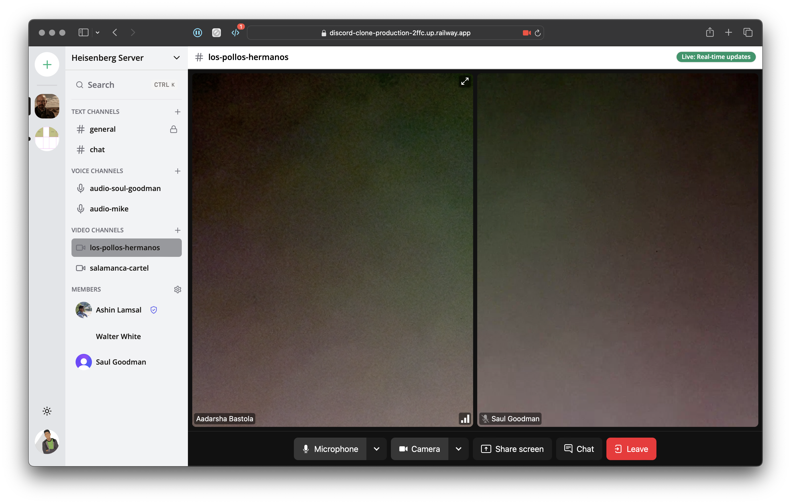

# Discord Clone
A discord clone created with ReactJS.

**Features:**
- User Roles
- Text, Audio and Video Channels
- Instant Messaging in Channels and between Members
- Action according to user roles

## Screenshots:

## Stack

 
Client

  <ul>
    <li>Typescript</a></li>
    <li>Next.js</a></li>
    <li>React.js</a></li>
    <li>TailwindCSS</a></li>
  </ul>

Database

  <ul>
    <li>Prisma</a></li>
  </ul>

### Special Thanks
[Code With Antonio](https://www.codewithantonio.com)